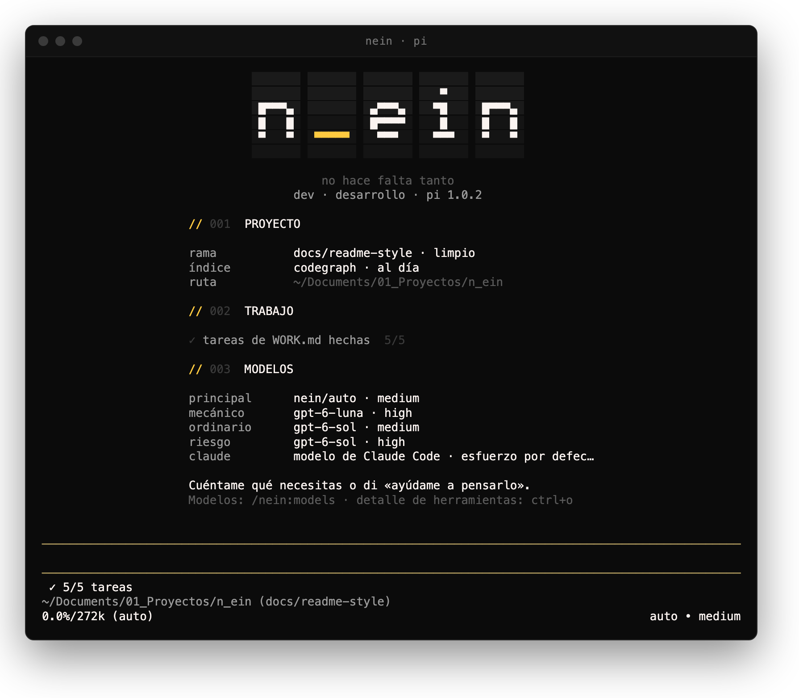
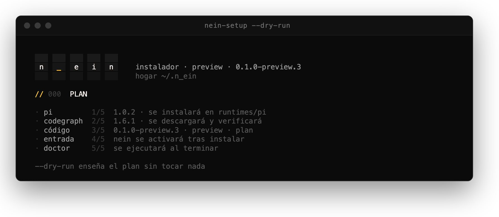

<div align="center">
  <br />
  <h1><code>./N_EIN.sh</code></h1>

**El mismo Ein por fuera, más simple por dentro: un entorno de programación sobre Pi que conversa, elige un modelo por encargo y deja el trabajo listo para revisar.**
<br /><br />

  
  <br/>
  
  
  <br/>
  
  
  
  <br/><br/>

[Releases](https://github.com/samuhlo/n_ein/releases) ·
[Guía de uso](docs/guia.md) ·
[Presentación](docs/00-presentacion.md) ·
[Decisiones](docs/01-decisiones.md)

  <code style="color:#737373;">// no hace falta tanto //</code>

  <br /><br />
  

  <br />
</div>

---

## // 00_ QUICK_START

```bash
gh release download v0.1.0-preview.3 -R samuhlo/n_ein --pattern 'n-ein-0.1.0-preview.3-darwin-arm64.tar.gz*'
shasum -a 256 -c n-ein-0.1.0-preview.3-darwin-arm64.tar.gz.sha256
tar -xzf n-ein-0.1.0-preview.3-darwin-arm64.tar.gz
./n-ein-0.1.0-preview.3-darwin-arm64/bin/nein-setup
nein
```

<div align="center">
  
</div>

La preview.3 necesita Bun y Node ≥22.19.0: `nein-setup` instala Pi y CodeGraph fijados dentro de `~/.n_ein`, sin tocar el `pi` global ni Ein legado. Hay candidato para macOS arm64 y Linux amd64. El primer arranque pide `/login` en el hogar aislado; ninguna credencial se copia.

> _note: la candidata `0.2.0-alpha.1` añade Node/Bun gestionados, instalación por curl y matriz macOS/Ubuntu/Arch. Está pendiente de revisión; [detalles](docs/releases/0.2.0-alpha.1.md). Los comandos anteriores siguen instalando la preview publicada._

> _note: `--dry-run` enseña el plan sin escribir. Sobre una preview anterior, `nein-setup` actualiza con backup y `n-ein-install restore --channel preview` vuelve atrás._

---

## // 01_ LA_FRICCIÓN

Ein organizaba el trabajo en siete fases, con subagentes por fase y un padre que no podía escribir código. Funcionaba, pero un cambio pequeño pedía demasiada ceremonia y demasiado mantenimiento.

n_ein (*new Ein* y *nein*) conserva lo que hacía agradable trabajar con Ein —launcher, instalador, la marca, la voz que enseña, el TODO y el relevo entre agentes— y retira el resto. Un agente trabaja directamente, con un modelo elegido para el encargo completo, y cierra con lo que comprobó y lo que queda pendiente.

---

## // 02_ CONVERSACIÓN

Abre `nein`, entra en Pi y cuenta qué necesitas. El agente elige las skills y no hace falta memorizar comandos.

| PUEDES DECIR | QUÉ OCURRE |
| :--- | :--- |
| «Ayúdame a pensar esta idea» | Investiga y plantea pocas decisiones, con recomendación (`intent`). |
| «Corrige este fallo» | Trabaja directamente si el encargo está claro. |
| «Vale, hazlo» | Construye el acuerdo dentro del alcance autorizado. |
| «Otra cosa: …» | Empieza otro encargo y elige de nuevo el modelo. |
| «Sigue donde lo dejamos» | Recupera decisiones, evidencia y pendiente antes de continuar. |

---

## // 03_ UN_MODELO_POR_ENCARGO

`nein/auto` clasifica la primera petición y mantiene el modelo hasta el final del encargo, para no perder la caché. Dentro del encargo solo sube de clase.

| CLASE | CUÁNDO | MODELO |
| :--- | :--- | :--- |
| **mecánico** | Textos, estilos, interfaz sin lógica | `gpt-6-luna` · high |
| **ordinario** | Comportamiento acotado | `gpt-6-sol` · medium |
| **riesgo** | Datos, permisos, contratos, concurrencia, despliegue | `gpt-6-sol` · high |
| **abierto** | Diseño sin cerrar | `gpt-6-sol` · high |

Un prefijo (`[luna]`, `[sol high]`) o `/nein:modo` lo fija a mano; `/nein:models` abre el panel de la tabla. La elección sale del [banco del 5 de octubre](evals/results/2026-10-05-modelos-de-trabajo.md).

---

## // 04_ RUNTIME_SURFACE

| PAPEL | ENTRADA | HOGAR DE N_EIN | RUNTIME VANILLA |
| :--- | :--- | :--- | :--- |
| **Launcher** | `nein` | `~/.n_ein/installations/<canal>` | — |
| **Principal · Pi** | `nein` → `p` | `~/.n_ein/<canal>/pi-agent` | `pi` → `~/.pi/agent` |

El paquete de Pi lleva el catálogo de skills, la voz y el TODO de `WORK.md`. CodeGraph indexa cada proyecto al abrirlo y el agente lo consulta antes de leer archivos.

---

## // 05_ COMMAND_DECK

```bash
nein                                  # portada: estado del proyecto, sesiones y sistema
nein --project . --runtime pi         # abre directamente, con el bloqueo del árbol
n-ein-install doctor --channel preview --runtime   # diagnostica la instalación
n-ein-install restore --channel preview            # vuelve al backup anterior
./scripts/hotfix-preview.sh plan|apply|rollback    # aplica un commit comprobado a la preview
```

Dentro de Pi:

| ATAJO | PARA QUÉ |
| :--- | :--- |
| `/nein:models` | Tabla de modelos y esfuerzo |
| `/nein:modo <clase>` · `/nein:nuevo` | Fijar la clase o empezar otro encargo |
| `/todo done N` · `/todo add …` | Marcar o añadir tareas de `WORK.md` |
| `Ctrl+O` | Detalle completo de las herramientas |

---

## // 06_ BLUEPRINT

```text
n_ein/
├── bin/          # nein, nein-setup y lanzadores de desarrollo
├── go/           # launcher (n-ein) e instalador (n-ein-install)
├── pi-package/   # lo que corre en Pi: extensiones, flujo, persona, tema y skills
├── scripts/      # checks, build de candidatos y hotfix
├── tests/        # pruebas deterministas de shell, Bun y Go
├── evals/        # bancos con modelos reales y sus resultados
└── docs/         # decisiones, diseño, plan, despliegue y guía
```

| LAYER | TECH |
| :--- | :--- |
| **Runtime** | Pi Coding Agent |
| **Launcher e instalador** | Go 1.27 |
| **Dentro de Pi** | TypeScript + Bun |
| **Índice de código** | CodeGraph 1.6.1 |
| **Delivery** | GitHub Actions · releases preview |

---

## // 07_ DESARROLLO

```bash
(cd go && go build -o ../dist/n-ein-install ./cmd/n-ein-install && go build -o ../dist/n-ein ./cmd/n-ein)
./dist/n-ein-install runtime --source .
./bin/n-ein-dev
```

`./scripts/check.sh` ejecuta los checks deterministas de shell, Bun y Go y prueba un paquete instalado fuera del checkout, sin llamadas a modelos; el [workflow](.github/workflows/check.yml) repite ese recorrido. Las evaluaciones con modelos se lanzan aparte.

> _note: el equipo de dos trabajadores en worktrees es experimental y solo se activa con `N_EIN_TEAM=1`. Sus [resultados](evals/results/2026-10-07-coordinacion-contexto.md) no justifican activarlo por defecto._

---

## // 08_ DOCS

| | |
| :--- | :--- |
| [Guía de uso](docs/guia.md) | todo el detalle: modelos, relevo, memoria, instalación, hotfix y launcher |
| [Empieza aquí](docs/START_HERE.md) | contexto del proyecto y estado de cada corte |
| [Decisiones](docs/01-decisiones.md) | qué está acordado y qué se descartó |
| [Diseño](docs/02-diseno.md) | recorrido, skills, continuidad, voz y estilo |
| [Despliegue](docs/05-despliegue.md) | canales, hogar gestionado y releases |
| [Evidencia](evals/results/) | qué se ha comprobado y con qué resultado |

---

## // 09_ ESTADO

Preview. La pública vigente es [0.1.0-preview.3](https://github.com/samuhlo/n_ein/releases/tag/v0.1.0-preview.3); las notas de cada versión están en [docs/releases](docs/releases/). Pendientes: la promoción a estable, la actualización remota desde la vista Sistema y Qwen local, aplazado hasta tener una máquina con 24 GB.

---

<div align="center">
<br />

<code>DESIGNED & CODED BY <a href="https://github.com/samuhlo">samuhlo</a></code>

<small>Lugo, Galicia</small>

</div>
