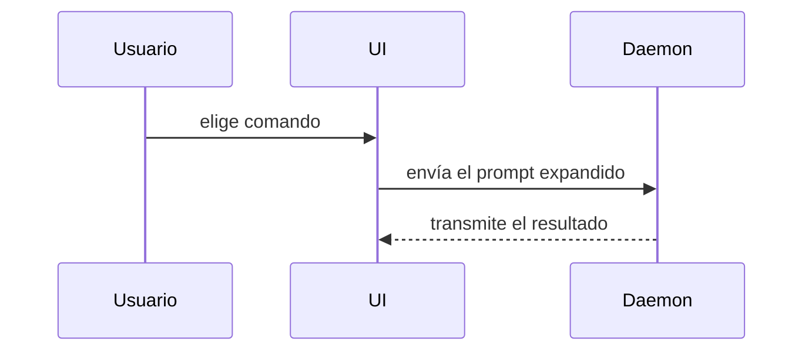

Usa esta plantilla para el cuerpo de la PR, en el idioma de los artefactos (traduce también los títulos si no es español):

```markdown
## Resumen

<diagrama, boceto de diff o árbol>

## Evidencia

- **Antes:** <captura/salida/test que falla>
  **Después:** <captura/salida/test que pasa>

## Riesgo del merge

**Puerta:** <de un sentido o de dos>

<opcional: descripción>

**Radio de impacto:** <descripción de una palabra>

<opcional: posibles consecuencias del merge>
```

## Secciones

Sin preámbulos y con prosa breve. Usa el lenguaje del dominio de `GLOSSARY.md`.

### Resumen

Elige la vista más pequeña que deje clara la idea clave.

- Lógica o un algoritmo, como pseudocódigo:

```text
on(save)
  if content is unchanged
    return cached result
  write new content
  return fresh result
```

- Flujo de control en ejecución, como árbol de llamadas:

```text
submitForm
  createSession
    persistPrompt
    launchAgent
  navigateToSession
```

- Estructura de interfaz, como árbol de componentes, con el estado y las fronteras de módulo que importan:

```text
<SessionPage> (apps/example/src/routes/session.tsx)
  useSessionEvents()
  <SessionToolbar>
    <RunSkillButton> (packages/ui)
```

- Responsabilidad de archivos o un refactor amplio, como árbol de archivos poco profundo:

```text
src/
├── commands/       # interpreta las acciones del usuario
├── sessions/       # posee el estado de la sesión
└── transport/      # envía las peticiones a la API
```

- Interacción entre componentes, flujo de control o de datos, con Mermaid:



- Usa `diff` cuando la idea es qué cambia y la forma de alrededor ya existe. Ajusta la forma del diff al tema.

Para un cambio de componente:

```diff
 <SessionPage>
   useSessionEvents()
   <SessionToolbar>
+    <RunSkillButton />
   <SessionTimeline>
+    <SkillResultCard />
```

Para un cambio en la disposición de archivos:

```diff
 src/
 ├── commands/
+│   └── show-me.ts       # expande el comando
 ├── sessions/
-└── transport.ts
+└── transport/
+    ├── client.ts
+    └── stream.ts
```

Para un cambio en un árbol o pila de llamadas:

```diff
 submitForm
   createSession
     persistPrompt
+    expandSkillMention
     launchAgent
-  navigateToSession
+  navigateToSession
+    subscribeToEvents
```

Para un cambio de estado o de flujo de control:

```diff
 on(save)
-  write content
+  if content is unchanged
+    return cached result
+  write new content
+  invalidate cache
```

- Enseña el bloque entero cuando casi todo es nuevo, cuando omitir el contexto escondería a quién pertenece algo o el orden, o cuando el lector necesita una forma objetivo que pueda copiar:

```ts
function expandSkill(command: string): string {
  const skillName = command.slice(1);
  return `use the ${skillName} skill`;
}
```

#### Criterio

Pon cada visual junto al texto breve al que apoya. Quédate solo con las llamadas, archivos, props, estados y fronteras necesarios para responder la pregunta actual del lector o las opciones del punto en discusión.

Puedes usar una de estas vistas o varias; es improbable que uses todas. Usa tu criterio y no abrumes al lector.

### Evidencia

Prueba concreta de que el cambio funciona. Enseña un antes y un después.

Las capturas son lo mejor cuando el entorno lo permite y el cambio es visual.

La evidencia de ejecución es lo siguiente: resultados de tests, salida de consola. Enseña el test exacto que antes fallaba y ahora pasa, en pseudocódigo.

### Riesgo del merge

Di si es una puerta de un sentido o de dos. Por una puerta de dos sentidos se puede volver; por una de un sentido, no. Una PR barata de revertir es de menor riesgo. Los cambios con acciones destructivas o decisiones difíciles de revertir son puertas de un sentido.

El radio de impacto es el alcance potencial de los cambios de la PR. Considera todas las posibilidades: saltos de maquetación, roturas para quien consume la API, comportamiento en móvil, etc.
